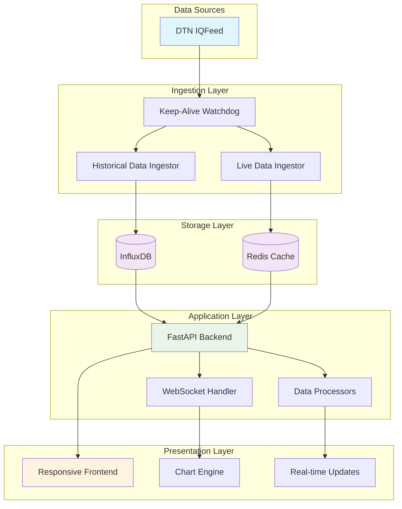

# EigenKor Real-Time Trading Charting Platform

A comprehensive, institutional-grade real-time financial charting platform designed for professional trading environments. Built with modern technologies and optimized for performance, this platform delivers TradingView-like functionality with real-time data streaming, advanced charting capabilities, and responsive design.


---

## 🚀 Features

### 📊 **Advanced Charting**
- **TradingView-Style Interface**: Professional-grade charting with smooth interactions
- **Multiple Chart Types**: Candlestick, Bar, Line, and Area charts
- **Real-time Updates**: Live data streaming with WebSocket connections
- **Historical Data**: Access to extensive market history with intelligent caching
- **Multiple Timeframes**: From 1-second to daily intervals with dynamic resampling

### 🎯 **Drawing Tools & Analysis**
- **Professional Drawing Tools**: Trend lines, horizontal lines, Fibonacci retracements, rectangles, and brush tool
- **Interactive Elements**: Click, drag, and modify drawing objects
- **Tool Management**: Easy selection, deletion, and bulk operations

### 📱 **Responsive Design**
- **Dynamic Layout**: Automatically adapts from mobile (320px) to ultra-wide displays (2560px+)
- **TradingView-like Responsiveness**: Smooth scaling and intelligent element repositioning
- **Cross-Device Compatibility**: Optimized for desktop, tablet, and mobile viewing
- **High-DPI Support**: Crisp rendering on all screen densities

### ⚡ **Performance & Reliability**
- **High-Performance Data Pipeline**: InfluxDB for historical data, Redis for real-time caching
- **Intelligent Caching**: Multi-layer caching strategy for optimal performance
- **Connection Management**: Robust DTN IQFeed connection with automatic reconnection
- **Error Handling**: Comprehensive error management and graceful degradation

### 🎨 **User Experience**
- **Dark/Light Themes**: Professional appearance with user preference persistence
- **Customizable Interface**: Configurable colors, layouts, and display options
- **Keyboard Shortcuts**: Efficient navigation and control
- **Export Capabilities**: High-quality chart screenshots and data export

### 🔧 **Technical Excellence**
- **Modular Architecture**: Clean separation of concerns with scalable design
- **API-First Design**: RESTful APIs with comprehensive documentation
- **Real-time Communication**: WebSocket-based live data streaming
- **Environment Management**: Secure configuration with environment variables

---

## 🏗️ Architecture Overview

The platform follows a modern microservices architecture with clear separation of concerns:



### **Data Flow Architecture**

1. **Data Ingestion Layer**
   - **Keep-Alive Service**: Ensures continuous DTN IQFeed connectivity
   - **Historical Ingestor**: Backfills and manages historical market data
   - **Live Data Ingestor**: Processes real-time trades and aggregates into bars

2. **Storage Layer**
   - **InfluxDB**: Time-series database for historical OHLCV data
   - **Redis**: High-performance caching and pub/sub for real-time data

3. **Application Layer**
   - **FastAPI Backend**: RESTful API server with async support
   - **WebSocket Handler**: Real-time data streaming to clients
   - **Data Processors**: Bar resampling and data transformation

4. **Presentation Layer**
   - **Responsive Frontend**: TradingView-style interface with adaptive design
   - **Chart Engine**: Lightweight Charts™ with custom enhancements
   - **Real-time Updates**: Seamless live data integration

---

## 🛠️ Technology Stack

### **Backend Technologies**
| Component | Technology | Version | Purpose |
|-----------|------------|---------|---------|
| **API Framework** | FastAPI | 0.104+ | High-performance async API |
| **Database** | InfluxDB | 2.x | Time-series data storage |
| **Cache** | Redis | 6.x+ | Real-time data & caching |
| **Data Source** | DTN IQFeed | - | Professional market data |
| **Language** | Python | 3.9+ | Backend development |
| **Server** | Uvicorn | - | ASGI server implementation |

### **Frontend Technologies**
| Component | Technology | Version | Purpose |
|-----------|------------|---------|---------|
| **Charting** | Lightweight Charts™ | Latest | High-performance charts |
| **UI Framework** | DaisyUI + Tailwind | 3.x | Responsive design system |
| **Language** | JavaScript ES6+ | - | Frontend logic |
| **Build Tools** | Modern Browser APIs | - | Native web technologies |
| **Icons** | Font Awesome | 6.x | Professional iconography |

---

## 📋 Prerequisites

Before setting up the platform, ensure you have the following installed and configured:

### **Required Software**
- **Python 3.9+** with pip package manager
- **Node.js 16+** (if customizing frontend build process)
- **Redis Server 6.x+** for caching and real-time data
- **InfluxDB 2.x** for time-series data storage
- **DTN IQConnect Client** from DTN Markets

### **Required Accounts & Subscriptions**
- **DTN IQFeed Subscription** with valid credentials
- **InfluxDB Cloud Account** (or local installation)
- **Redis Cloud Account** (or local installation)

### **System Requirements**
- **Minimum**: 4GB RAM, 2 CPU cores, 10GB storage
- **Recommended**: 8GB RAM, 4 CPU cores, 50GB storage
- **Operating System**: Windows 10+, macOS 10.15+, or Linux (Ubuntu 20.04+)

---

## 🚀 Quick Start Guide

### **1. Repository Setup**

```bash
# Clone the repository
git clone <repository-url>
cd eigenkor-trading-platform

# Create Python virtual environment
python -m venv venv

# Activate virtual environment
# On Windows:
venv\Scripts\activate
# On macOS/Linux:
source venv/bin/activate

# Install dependencies
pip install -r requirements.txt
```

### **2. Environment Configuration**

Create a `.env` file in the project root:

```env
# =============================================================================
# EigenKor Trading Platform Configuration
# =============================================================================

# DTN IQFeed Credentials
DTN_PRODUCT_ID=your_product_id_here
DTN_LOGIN=your_login_here
DTN_PASSWORD=your_password_here

# InfluxDB Configuration
INFLUX_URL=http://localhost:8086
INFLUX_TOKEN=your_influxdb_token_here
INFLUX_ORG=your_organization_name
INFLUX_BUCKET=trading_data

# Redis Configuration
REDIS_URL=redis://localhost:6379/0
CELERY_BROKER_URL=redis://localhost:6379/0
CELERY_RESULT_BACKEND=redis://localhost:6379/0

# Application Settings
LOG_LEVEL=INFO
DEBUG=false
API_HOST=0.0.0.0
API_PORT=8000
```

### **3. Database Setup**

```bash
# Start InfluxDB (if running locally)
influxd

# Start Redis (if running locally)
redis-server

# Verify connections
python -c "import redis; r = redis.Redis.from_url('redis://localhost:6379/0'); print('Redis OK:', r.ping())"
```

### **4. Service Startup**

Run each service in a separate terminal window:

```bash
# Terminal 1: Start IQFeed Keep-Alive Service
python ingestion_service/iqfeed_keep_alive.py

# Terminal 2: Start Live Data Ingestor
python ingestion_service/live_data_ingestor.py

# Terminal 3: Start Historical Data Ingestor (Optional)
python ingestion_service/iqfeed_ingestor.py

# Terminal 4: Start API Server
uvicorn app.main:app --host 0.0.0.0 --port 8000 --reload
```

### **5. Access the Platform**

Open your web browser and navigate to:
```
http://localhost:8000
```

---

## 📁 Project Structure

```
eigenkor-trading-platform/
├── 📂 app/                          # FastAPI Backend Application
│   ├── 📂 routers/                  # API endpoint definitions
│   │   ├── historical_data_router.py
│   │   ├── live_data_router.py
│   │   └── utility_router.py
│   ├── 📂 services/                 # Business logic services
│   │   ├── data_service.py
│   │   └── cache_service.py
│   ├── 📄 main.py                   # FastAPI application entry point
│   ├── 📄 config.py                 # Configuration management
│   ├── 📄 schemas.py                # Data models and schemas
│   └── 📄 cache.py                  # Redis caching utilities
│
├── 📂 frontend/                     # Frontend Application
│   ├── 📂 static/                   # Static assets
│   │   ├── 📂 css/                  # Stylesheets
│   │   │   └── style.css            # Main stylesheet with responsive design
│   │   └── 📂 js/                   # JavaScript modules
│   │       ├── 📂 app/              # Application modules
│   │       │   ├── 1-dom-elements.js      # DOM element references
│   │       │   ├── 2-state.js             # Application state management
│   │       │   ├── 3-chart-options.js     # Chart configuration
│   │       │   ├── 4-ui-helpers.js        # UI utility functions
│   │       │   ├── 5-chart-drawing.js     # Chart rendering logic
│   │       │   ├── 6-api-service.js       # API communication
│   │       │   ├── 7-event-listeners.js   # Event handling
│   │       │   └── 8-responsive-handler.js # Responsive design logic
│   │       └── main.js              # Main application entry point
│   ├── 📂 dist/                     # Chart library distribution
│   │   ├── lightweight-charts.standalone.production.js
│   │   └── typings.d.ts
│   └── 📄 index.html                # Main HTML template
│
├── 📂 ingestion_service/            # Data Ingestion Services
│   ├── 📂 pyiqfeed/                 # IQFeed Python library
│   ├── 📄 config.py                 # Ingestion service configuration
│   ├── 📄 dtn_iq_client.py          # DTN IQFeed client management
│   ├── 📄 iqfeed_ingestor.py        # Historical data ingestion
│   ├── 📄 live_data_ingestor.py     # Real-time data ingestion
│   └── 📄 iqfeed_keep_alive.py      # Connection watchdog service
│
├── 📄 requirements.txt              # Python dependencies
├── 📄 .env.example                  # Environment configuration template
├── 📄 .gitignore                    # Git ignore rules
└── 📄 README.md                     # This documentation
```

---

## 🔧 Configuration Guide

### **Environment Variables**

| Variable | Description | Default | Required |
|----------|-------------|---------|----------|
| `DTN_PRODUCT_ID` | DTN IQFeed product identifier | - | ✅ |
| `DTN_LOGIN` | DTN IQFeed username | - | ✅ |
| `DTN_PASSWORD` | DTN IQFeed password | - | ✅ |
| `INFLUX_URL` | InfluxDB server URL | `http://localhost:8086` | ✅ |
| `INFLUX_TOKEN` | InfluxDB authentication token | - | ✅ |
| `INFLUX_ORG` | InfluxDB organization name | - | ✅ |
| `INFLUX_BUCKET` | InfluxDB bucket name | `trading_data` | ✅ |
| `REDIS_URL` | Redis server connection URL | `redis://localhost:6379/0` | ✅ |
| `API_HOST` | API server host address | `0.0.0.0` | ❌ |
| `API_PORT` | API server port number | `8000` | ❌ |

### **Chart Configuration**

The platform supports extensive chart customization through the settings modal:

- **Visual Themes**: Light and dark modes with custom color schemes
- **Chart Types**: Candlestick, bar, line, and area charts
- **Drawing Tools**: Professional drawing tools with persistence
- **Time Zones**: Multiple timezone support for global markets
- **Responsive Design**: Automatic adaptation to screen size changes

### **Performance Tuning**

For optimal performance in production environments:

```python
# In app/config.py - adjust these settings based on your hardware
REDIS_CONNECTION_POOL_SIZE = 50
INFLUXDB_BATCH_SIZE = 1000
WEBSOCKET_MAX_CONNECTIONS = 100
CHART_UPDATE_INTERVAL_MS = 100
```

---

## 🚀 Advanced Features

### **Real-time Data Streaming**

The platform implements a sophisticated real-time data pipeline:

```javascript
// WebSocket connection with automatic reconnection
const ws = new WebSocket('ws://localhost:8000/ws/live-data');
ws.onmessage = (event) => {
    const data = JSON.parse(event.data);
    updateChart(data);
};
```

### **Responsive Design System**

TradingView-style responsive behavior with breakpoints:

- **Mobile**: 320px - 639px (Simplified interface)
- **Tablet Portrait**: 640px - 767px (Compact layout)
- **Tablet Landscape**: 768px - 1023px (Balanced view)
- **Desktop**: 1024px - 1439px (Full features)
- **Large Desktop**: 1440px+ (Expanded interface)

### **Drawing Tools API**

Professional drawing tools with programmatic access:

```javascript
// Add trend line programmatically
const trendLine = chart.createLineTool('TrendLine', {
    points: [{ time: '2023-01-01', price: 100 }, { time: '2023-01-31', price: 120 }]
});
```

### **Data Export Capabilities**

Export chart data and images:

```javascript
// Export chart as high-quality image
const screenshot = await chart.takeScreenshot({
    format: 'png',
    quality: 1.0,
    width: 1920,
    height: 1080
});
```

---

## 🔒 Security Considerations

### **Environment Security**
- Store sensitive credentials in `.env` files (never commit to version control)
- Use strong passwords and API tokens
- Implement proper CORS policies for production deployment

### **Network Security**
- Configure firewall rules to restrict database access
- Use HTTPS in production environments
- Implement rate limiting for API endpoints

### **Data Security**
- Regular backups of InfluxDB data
- Encrypted connections to external services
- Audit logging for trading activities

---

## 📊 Performance Metrics

### **Expected Performance**
- **Chart Rendering**: 60 FPS on modern browsers
- **Data Latency**: < 100ms for real-time updates
- **Memory Usage**: < 500MB for typical desktop usage
- **Storage**: ~1GB per million OHLC bars

### **Optimization Tips**
- Use Redis clustering for high-throughput scenarios
- Implement data retention policies in InfluxDB
- Enable GZip compression for API responses
- Use CDN for static asset delivery in production

---

## 🔄 Development Workflow

### **Local Development**

```bash
# Start development environment
./scripts/dev-start.sh

# Run tests
python -m pytest tests/

# Format code
black app/ ingestion_service/
flake8 app/ ingestion_service/

# Type checking
mypy app/ ingestion_service/
```

### **Adding New Features**

1. **Backend Changes**: Add new API endpoints in `app/routers/`
2. **Frontend Changes**: Create new modules in `frontend/static/js/app/`
3. **Data Models**: Update schemas in `app/schemas.py`
4. **Database Changes**: Create migration scripts for InfluxDB

---

## 🆘 Troubleshooting

### **Common Issues**

| Issue | Cause | Solution |
|-------|-------|----------|
| Chart not loading | Missing chart container | Verify `#chartContainer` element exists |
| No real-time data | IQFeed connection issue | Check DTN credentials and connection |
| Slow performance | Redis connection timeout | Verify Redis server is running |
| Memory leaks | WebSocket not closed | Implement proper cleanup in `beforeunload` |

### **Debug Mode**

Enable debug logging:

```python
# In app/main.py
logging.getLogger().setLevel(logging.DEBUG)
```

### **Health Checks**

Verify system health:

```bash
# Check API health
curl http://localhost:8000/health

# Check Redis connection
redis-cli ping

# Check InfluxDB connection
influx ping --host http://localhost:8086
```

---

## 📈 Roadmap

### **Version 2.1 (Planned)**
- [ ] Multi-symbol watchlists
- [ ] Advanced order management
- [ ] Custom indicator framework
- [ ] Mobile app (React Native)

### **Version 2.2 (Future)**
- [ ] Machine learning price predictions
- [ ] Social trading features
- [ ] Advanced analytics dashboard
- [ ] Multi-exchange support

---

## 🤝 Contributing

This is a proprietary platform developed by EigenKor. For internal development:

1. Follow the established coding standards
2. Write comprehensive tests for new features
3. Update documentation for API changes
4. Submit pull requests with detailed descriptions

---

## 📞 Support

For technical support and questions:

- **Internal Support**: Contact the development team
- **Documentation**: Refer to this README and inline code comments
- **Issue Tracking**: Use the internal issue tracking system

---

## 📄 License

This software is proprietary to EigenKor. All rights reserved.

**Copyright © 2024 EigenKor Technologies**

---

## 🙏 Acknowledgments

- **TradingView** for UI/UX inspiration
- **Lightweight Charts™** for the excellent charting library
- **DTN Markets** for professional market data
- **FastAPI Community** for the robust web framework

---

<div align="center">

**Built with ❤️ by the EigenKor Development Team**

*Professional Trading Technology Solutions*

</div>